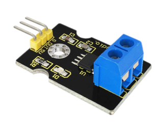
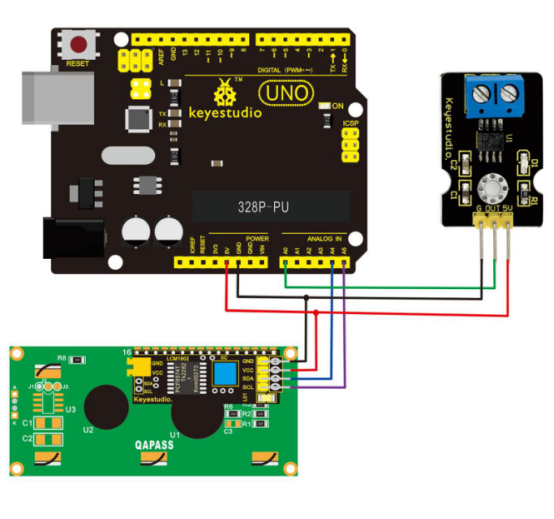
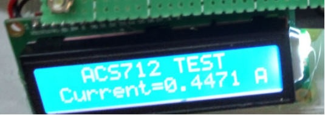

# KS0187 keyestudio ACS712-5A Current Sensor



## 1. Introduction

ACS712-5A Current Sensor is used to measure the intensity of current. It contains ACS712ELC-5B chip, based on Hall Effect. You should protect it from influence of magnetic field when using it.

## 2. Parameters

- Chip:ACS712ELC-5B
- 5V Power Supply and Power Indicator On-board
- This module can detect 5A positive and negative current,corresponding analog output at 185mV/A.
- Output voltage is VCC/2 without current flowing

## 3. Connection Diagram



## 4. Sample Code

Download Resources:  [Resources](./Resources.7z)

```c
#include <Wire.h>  //invoking I2Clibraries coming with Arduino
#include <LiquidCrystal_I2C.h>
LiquidCrystal_I2C lcd(0x27,16,2); 

int temp;

// the setup routine runs once when you press reset:
void setup() 
{
    // initialize serial communication at 9600 bits per second:
    lcd.init();
    delay(100);
    lcd.backlight();
    Wire.begin();  //initializing I2C
    lcd.clear(); //clear screen

    delay(100);
    lcd.setCursor(2,0);
    lcd.print("ACS712 TEST");
    delay(200);
    Serial.begin(9600);
}

// the loop routine runs over and over again forever:
void loop() 
{
    // read the input on analog pin 0:
    float current = analogRead(A0);
    temp=current;
    temp=temp-512;
    current=temp/35.8;
    //lcd.clear(); //clear screen
    // print out the value you read:
    Serial.print("current=");
    Serial.print(current);
    Serial.println("A");
    lcd.setCursor(0,1);
    lcd.print("Current=");
    lcd.setCursor(8,1);
    lcd.print(current);
    lcd.setCursor(15,1);
    lcd.print("A");
    delay(300);        // delay in between reads for stability
}
```

## 5. Result

In order to display data conveniently, add I2C LCD1602 Module. Then upload program and connect wires. 

After plugging in power, LED on this sensor is on and I2C LCD1602 Module displays the current intensity shown as below.

